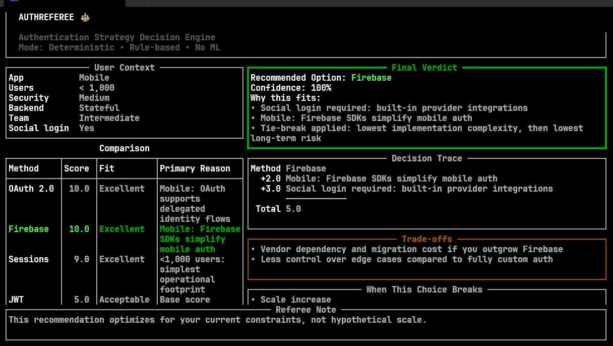
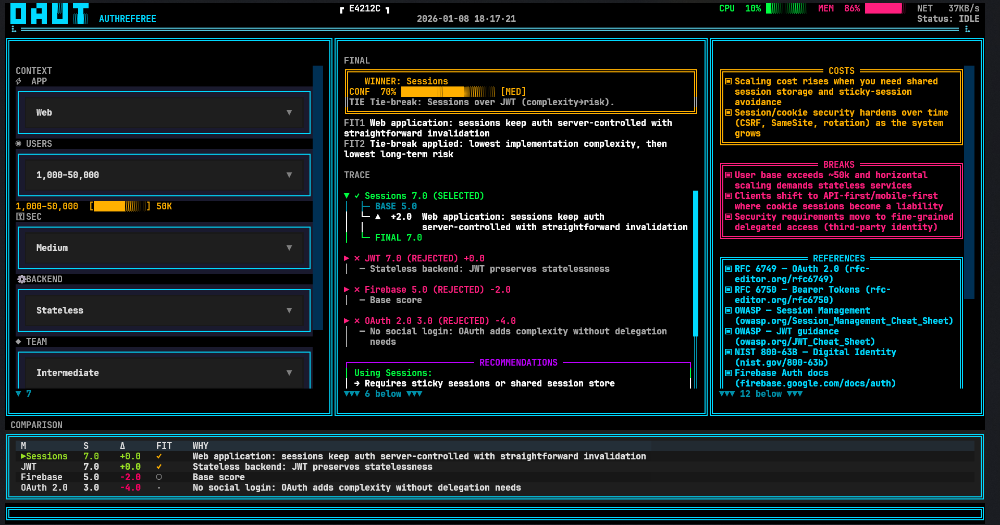

# AUTHREFEREE

Terminal-based authentication strategy decision engine.

Deterministic, rule-based (no ML): given a small set of product constraints, AuthReferee ranks common auth approaches and explains *why*.

## Requirements

- Python 3.11+ (tested on 3.12)
- `textual`
- `psutil`

## Install

```powershell
python -m venv .venv
.\.venv\Scripts\pip install -r requirements.txt
```

## Run

```powershell
.\.venv\Scripts\python main.py
```

### Quick launch helpers (Windows)

- Double-click (Explorer): `run.bat`
- PowerShell: `./run.ps1`
- Git Bash / WSL (opens PowerShell): `./run.sh` (optional)

## What it does

- Scores 4 authentication strategies deterministically (rule-based)
- Shows a live-updating Textual dashboard (cyberpunk console)
- Provides an expandable TRACE explanation + a recommendations box

## Screenshots

Old UI (earliest version):



Updated UI (current Textual build):



> Drop the two screenshots into `docs/screenshots/` as `old.png` and `updated.png`.

## Roadmap / Change Log (Tree)

```
AuthReferee
├─ Phase 1 — Deterministic engine
│  ├─ User context model + enums
│  ├─ Rule-weighted scoring
│  └─ Verdict builder (winner + confidence + reasons)
├─ Phase 2 — Textual UX pass
│  ├─ Busy/loading controller (200ms threshold)
│  ├─ Skeleton placeholders while busy
│  ├─ Diff-based “flash” highlighting on change
│  ├─ Manual tweening for stable animations (no Textual animator collision)
│  └─ Scroll indicators for long panels
├─ TRACE redesign
│  ├─ Compact per-method summary + expandable details
│  ├─ Strict vertical-only scrolling
│  ├─ No truncation: full wrapping + continuation lines
│  └─ In-panel scrollbar (track/thumb) rendered inside TRACE
├─ Recommendations
│  ├─ Boxed recommendations beneath TRACE
│  └─ Clear “To enable this:” hints for rejected options
├─ Right panel polish
│  ├─ Boxed COSTS / BREAKS / REFERENCES / LOSERS
│  ├─ Stable, non-emoji pixel bullets
│  ├─ “▶” pointer for changed lines when selects update
│  └─ LOSERS color distinct from BREAKS
└─ Maintenance
	├─ Guard against Select misclick crashes (fallback to last valid context)
	└─ Removed unused legacy Rich TUI files
```
